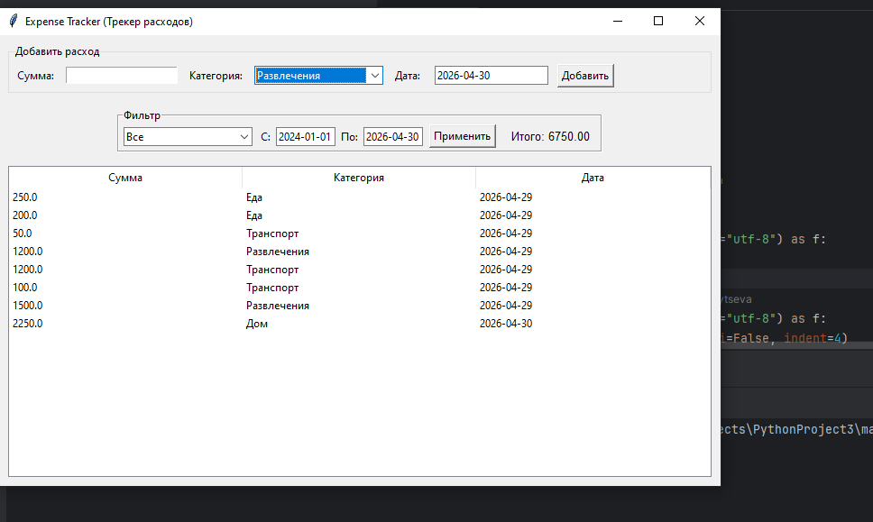
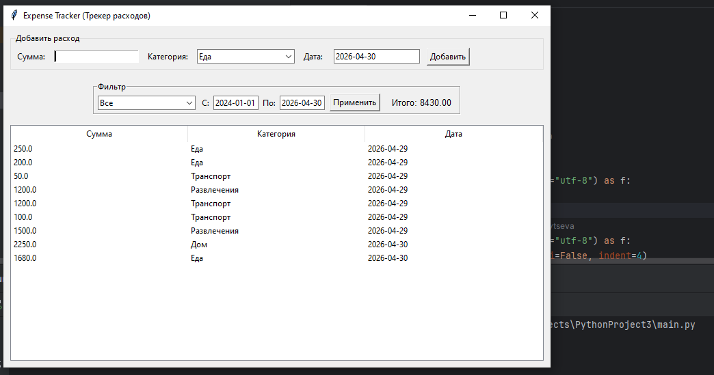
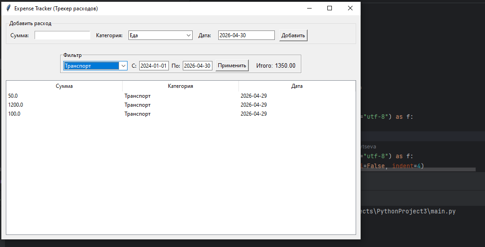
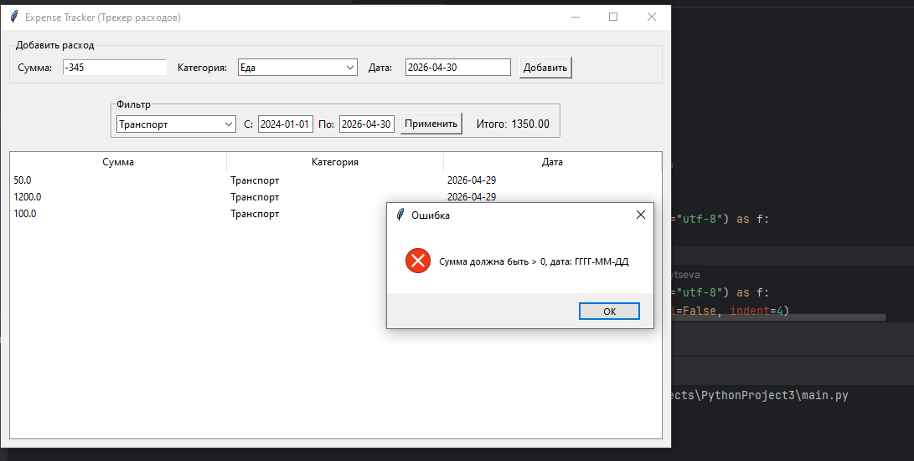

# Expense Tracker - Трекер расходов

## Информация об авторе
**Автор: ** [Зайцева Василиса]
**Дата создания: ** [29.04.2026]

## Описание программы
Приложения по отслеживанию расходов с графическим интерфейсом. 
Позволяет записывать траты, отслеживать и подсчитывать расходы. 

### Возможности программы:
    - Добавление записей: сумма, категория, дата
    - Валидация: проверка суммы на положительное число; проверка корректности даты
    - Хранение данных: все данные автоматически сохраняются в файл "expenses.json"
    - Фильтрация: возможность просматривать расходы по определенным категориям или датам
    - Подсчет: автоматический подсчет всех расходов или всех расходов по категориям

### Проверка корректности ввода
    - ** Проверка положительной суммы **
    - ** Проверка формата даты **

## Установка и запуск
### Требования
    - Python 3.6 или выше
    - Стандартные библиотеки Python (Tkinter, json, os, datetime)

### Запуск программы:
    1. Сохраните файл "main.py" в любую папку.
    2. Откройте терминал или командную строку.
    3. Перейдите в папку с программой и запустите ее.
    4. Добавление: Заполните поле "Сумма", выберите категорию из списка и нажмите кнопку "Добавить".
    5. Фильтрация: В блоке "Фильтр" выберите нужную категорию (или "Все") и укажите даты "С" и "По", затем нажмите "Применить".
    6. Просмотр: Все данные отображаются в таблице в нижней части окна.
### Тесты: 
    1. Тест добавления: Введите сумму `100`, категория `Еда`, нажмите "Добавить". Запись появится в таблице.
    2. Тест валидации: Введите в сумму текст `abc` или отрицательное число `-50`. Программа выдаст сообщение об ошибке.
    3. Тест фильтра: Добавьте несколько трат в разные категории. Выберите в фильтре "Транспорт". В таблице останутся только расходы на транспорт, а итоговая сумма обновится.

### Примеры работы программы:

